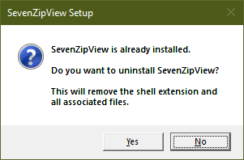

<h1 align="center">🗜️ SevenZipView</h1>

<p align="center">
  <strong>A Native Windows Explorer Shell Extension for 7-Zip Archives</strong>
</p>

<p align="center">
  <a href="#features">Features</a> •
  <a href="#download">Download</a> •
  <a href="#installation">Installation</a> •
  <a href="#building">Building</a> •
  <a href="#architecture">Architecture</a> •
  <a href="#license">License</a>
</p>

<p align="center">
  
  
  
  
</p>

---

## Overview

**SevenZipView** is a lightweight, high-performance Windows Shell Extension that seamlessly integrates 7-Zip archive browsing directly into Windows Explorer. Unlike traditional archive managers that require opening a separate application, SevenZipView allows you to navigate `.7z` archives as if they were regular folders — with full support for preview, properties, icons, and context menus.

Built entirely in modern C++17 with the official 7-Zip LZMA SDK, SevenZipView provides native performance with zero external dependencies. The DLL is statically linked, meaning it works out of the box without requiring any runtime libraries or additional software installation.


---

## Features

### 🗂️ Virtual Shell Folder Navigation
Browse inside `.7z` archives directly in Windows Explorer as if they were regular folders. Navigate through nested directories, view file listings with full details, and interact with archive contents using familiar Explorer operations.

### 👁️ Preview Handler
Preview text files, documents, and other supported content directly in the Explorer preview pane without extracting. Supports syntax highlighting for code files and handles large files efficiently through streaming.

### 📊 Property Handler
View detailed archive and file properties in the Explorer Details pane:
- **File Count** — Total number of files in the archive
- **Folder Count** — Number of directories
- **Compression Ratio** — Space savings percentage
- **Compression Method** — Algorithm used (LZMA, LZMA2, etc.)
- **Encryption Status** — Whether the archive is password-protected
- Individual file sizes (compressed and uncompressed)
- CRC32 checksums
- Modification dates

### 🎨 Custom Icon Handler
Distinctive icons for `.7z` files that integrate naturally with the Windows shell, making archives easily identifiable in any folder view.

### 📋 Context Menu Integration
Right-click any `.7z` file to access powerful extraction options:

| Command | Description |
|---------|-------------|
| **Extract Here** | Extract all contents to the current folder |
| **Extract to Folder...** | Extract to a named subfolder |
| **Test Archive** | Verify archive integrity without extracting |

When browsing inside an archive, additional context menu options are available:
- **Open** — Open/extract the selected file
- **Copy** — Copy files to clipboard for pasting elsewhere
- **Extract To...** — Extract selected items to a specific location
- **Properties** — View detailed file information

### ⚡ Performance Optimized
- **Archive Pooling** — Open archives are cached in memory for instant navigation
- **Lazy Loading** — Directory contents are loaded on-demand
- **Streaming Extraction** — Large files are processed without loading entirely into memory
- **Thread-Safe** — All operations support concurrent access

### 🔒 Security
- **UAC Compliant** — Installer requests elevation only when necessary
- **Code Signed** — (Optional) Support for Authenticode signing
- **No Network Access** — Completely offline operation

---

## Download

### Latest Release

<p align="center">
  <a href="https://github.com/HermesSilva/7ZipShell/releases/latest/download/SevenZipViewSetup.exe">
    
  </a>
</p>

**Direct Link:** [SevenZipViewSetup.exe](./x64/Release/SevenZipViewSetup.exe)

| File | Size | Description |
|------|------|-------------|
| `SevenZipViewSetup.exe` | ~530 KB | Self-contained installer with embedded DLL |

> **Note:** The setup executable contains the shell extension DLL embedded as a resource. No additional files are required for installation.

---

## Installation

### Automatic Installation (Recommended)

1. Download `SevenZipViewSetup.exe`
2. Run the installer (UAC elevation will be requested)
3. Click **Yes** when prompted to install
4. Windows Explorer will restart automatically to load the extension

The installer will:
- Copy `SevenZipView.dll` to `C:\Program Files\Tootega\SevenZipView\`
- Register all COM components using `regsvr32`
- Create an uninstall entry in **Add/Remove Programs**
- Restart Explorer to apply changes

#### Installation Dialog
<p align="center">
  
</p>

#### Uninstallation Dialog
<p align="center">
  
</p>

### Silent Installation

For deployment scenarios, the installer supports command-line options:

```batch
# Silent install
SevenZipViewSetup.exe /S /I

# Silent uninstall
SevenZipViewSetup.exe /S /U

# Show help
SevenZipViewSetup.exe /?
```

### Manual Installation

If you prefer manual installation:

```powershell
# Copy DLL to Program Files (requires Administrator)
Copy-Item "SevenZipView.dll" "C:\Program Files\Tootega\SevenZipView\" -Force

# Register the shell extension
regsvr32 "C:\Program Files\Tootega\SevenZipView\SevenZipView.dll"

# Restart Explorer
Stop-Process -Name explorer -Force
Start-Process explorer
```

### Uninstallation

**Via Control Panel:**
1. Open **Settings** → **Apps** → **Installed Apps**
2. Find **SevenZipView**
3. Click **Uninstall**

**Via Command Line:**
```powershell
# Run the setup in uninstall mode
SevenZipViewSetup.exe /U
```

**Manual Uninstallation:**
```powershell
# Unregister the DLL
regsvr32 /u "C:\Program Files\Tootega\SevenZipView\SevenZipView.dll"

# Remove files
Remove-Item "C:\Program Files\Tootega\SevenZipView" -Recurse -Force

# Restart Explorer
Stop-Process -Name explorer -Force
Start-Process explorer
```

---

## Building

### Prerequisites

| Requirement | Version | Notes |
|------------|---------|-------|
| **Visual Studio** | 2022 (v143 toolset) | Required for C++17/20 features and ATL support |
| **Windows SDK** | 10.0.19041.0 or later | Windows 10 May 2020 Update SDK or newer |
| **C++ Standard** | C++17 or higher | Uses `std::optional`, `std::string_view`, `std::format` |
| **Platform** | x64 only | 32-bit (x86) is not supported |
| **TootegaWinLib** | Latest | See [TootegaWinLib](../TootegaWinLib/README.md) |

### Dependencies

#### TootegaWinLib (Required)

This project depends on **TootegaWinLib**, the shared Windows C++ library for Tootega tools. TootegaWinLib provides:

- **Shell Extension Infrastructure** — Base classes for COM objects, class factories, and shell registration utilities (`XShell.h`)
- **Result Type** — Robust error handling with `XResult<T>` and `XError` classes
- **Registry Utilities** — Type-safe registry operations via `XRegistry`
- **String Utilities** — Encoding conversion, formatting, and manipulation via `XString`
- **Memory Management** — Secure buffers, RAII wrappers, and alignment utilities via `XMemory`
- **Logging** — Thread-safe logging infrastructure via `XLogger`
- **RAII Types** — Smart handle wrappers for Windows resources (`XTypes.h`)

The library must be built before SevenZipView. Ensure `TootegaWinLib.vcxproj` is included in the solution and set as a dependency.

```
TootegaWinLib/
├── Include/
│   ├── TootegaWinLib.h          # Master include header
│   ├── XShell.h                 # Shell extension aggregation
│   ├── Shell/                   # Shell extension components
│   │   ├── XShellExtension.h    # COM base classes
│   │   ├── XShellRegistry.h     # Shell registration
│   │   ├── XContextMenu.h       # Context menu base
│   │   ├── XPropertyHandler.h   # Property handler base
│   │   ├── XIconHandler.h       # Icon handler base
│   │   ├── XPreviewHandler.h    # Preview handler base
│   │   └── XShellFolder.h       # Shell folder namespace
│   └── ...
└── Source/
    └── ...
```

**Documentation:** See [TootegaWinLib README](../TootegaWinLib/README.md) for complete details.

#### 7-Zip LZMA SDK (Embedded)

The **LZMA SDK** from [7-Zip](https://www.7-zip.org/sdk.html) is embedded directly in the project under `7zip-sdk/`. This provides:

- 7z format parsing and decompression
- LZMA/LZMA2 codec support
- AES-256 decryption for encrypted archives
- BCJ/BCJ2 and Delta filters

The SDK is **public domain** and requires no attribution.

### Build from Command Line

```powershell
# Clone the repository
git clone https://github.com/tootega/7ZipShell.git
cd 7ZipShell

# Build Release configuration
MSBuild SevenZipView.slnx /p:Configuration=Release /p:Platform=x64

# Build Debug configuration
MSBuild SevenZipView.slnx /p:Configuration=Debug /p:Platform=x64
```

### Build from Visual Studio

1. Open `SevenZipView.slnx` in Visual Studio 2022
2. Select **Release | x64** configuration
3. Build Solution (Ctrl+Shift+B)

### Build Output

```
x64/
├── Release/
│   ├── SevenZipView.dll          # Shell extension (396 KB)
│   ├── SevenZipViewSetup.exe     # Installer with embedded DLL (530 KB)
│   ├── SevenZipView.lib          # Import library
│   └── SevenZipView.pdb          # Debug symbols
└── Debug/
    ├── SevenZipView.dll
    └── ...
```

### Project Structure

```
7ZipShell/
├── SevenZipView.slnx              # Visual Studio solution
├── README.md                       # This file
├── LICENSE                         # MIT License
├── Install.ps1                     # PowerShell installer script
├── Uninstall.ps1                   # PowerShell uninstaller script
│
├── SevenZipView/                   # Main DLL project
│   ├── CMakeLists.txt             # CMake build (alternative)
│   ├── SevenZipView.vcxproj       # Visual Studio project
│   ├── SevenZipView.def           # DLL exports
│   │
│   ├── include/                   # Header files
│   │   ├── Common.h               # Shared definitions
│   │   ├── Archive.h              # Archive reader interface
│   │   ├── ArchiveEntry.h         # Archive entry data structure
│   │   ├── ShellFolder.h          # IShellFolder implementation
│   │   ├── ContextMenu.h          # IContextMenu implementation
│   │   ├── PreviewHandler.h       # IPreviewHandler implementation
│   │   ├── PropertyHandler.h      # IPropertyStore implementation
│   │   ├── IconHandler.h          # IExtractIcon implementation
│   │   └── Extractor.h            # Extraction engine
│   │
│   ├── src/                       # Source files
│   │   ├── DllMain.cpp            # Entry point & COM registration
│   │   ├── Core/
│   │   │   └── Archive.cpp        # 7z SDK wrapper
│   │   └── Shell/
│   │       ├── ShellFolder.cpp    # Virtual folder implementation
│   │       ├── ContextMenu.cpp    # Context menu handlers
│   │       ├── PreviewHandler.cpp # Preview pane support
│   │       ├── PropertyHandler.cpp# Properties support
│   │       ├── IconHandler.cpp    # Icon extraction
│   │       └── Extractor.cpp      # Extraction with progress
│   │
│   ├── 7zip-sdk/                  # Embedded 7-Zip LZMA SDK
│   │   ├── 7z.h                   # Main 7z header
│   │   ├── 7zAlloc.c/h            # Memory allocators
│   │   ├── 7zArcIn.c              # Archive input
│   │   ├── 7zDec.c                # Decoder
│   │   ├── LzmaDec.c/h            # LZMA decoder
│   │   ├── Lzma2Dec.c/h           # LZMA2 decoder
│   │   └── ...                    # Additional codec support
│   │
│   └── resources/
│       └── SevenZipView.rc        # Version info & resources
│
├── Installer/                      # Setup executable project
│   ├── SevenZipViewSetup.vcxproj
│   ├── Setup.cpp                  # Installer logic
│   ├── Setup.rc                   # Resources (includes DLL)
│   └── Setup.manifest             # UAC manifest
│
└── x64/                           # Build output
    ├── Release/
    └── Debug/
```

---

## Architecture

### COM Components

SevenZipView registers five COM classes with the Windows Shell:

| CLSID | Interface | Purpose |
|-------|-----------|---------|
| `{7A8B9C0D-1E2F-3A4B-5C6D-7E8F9A0B1C2D}` | `IShellFolder2` | Virtual folder navigation |
| `{8B9C0D1E-2F3A-4B5C-6D7E-8F9A0B1C2D3E}` | `IPreviewHandler` | Preview pane support |
| `{9C0D1E2F-3A4B-5C6D-7E8F-9A0B1C2D3E4F}` | `IPropertyStore` | Property handler |
| `{0D1E2F3A-4B5C-6D7E-8F9A-0B1C2D3E4F5A}` | `IContextMenu` | Right-click menus |
| `{1E2F3A4B-5C6D-7E8F-9A0B-1C2D3E4F5A6B}` | `IExtractIconW` | Custom icons |

### Shell Integration Flow

```
┌─────────────────────────────────────────────────────────────────┐
│                     Windows Explorer                            │
├─────────────────────────────────────────────────────────────────┤
│                                                                 │
│  ┌──────────────┐    ┌──────────────┐    ┌──────────────┐       │
│  │  File List   │    │ Preview Pane │    │Details Pane  │       │
│  │  (IShell     │    │ (IPreview    │    │(IProperty    │       │
│  │   Folder2)   │    │  Handler)    │    │ Store)       │       │
│  └──────┬───────┘    └──────┬───────┘    └──────┬───────┘       │
│         │                   │                   │               │
└─────────┼───────────────────┼───────────────────┼───────────────┘
          │                   │                   │
          ▼                   ▼                   ▼
┌─────────────────────────────────────────────────────────────────┐
│                    SevenZipView.dll                             │
├─────────────────────────────────────────────────────────────────┤
│                                                                 │
│  ┌───────────────────────────────────────────────────────────┐  │
│  │                    Archive Pool (Cache)                   │  │
│  └───────────────────────────┬───────────────────────────────┘  │
│                              │                                  │
│  ┌───────────────────────────▼───────────────────────────────┐  │
│  │                      Archive Class                        │  │
│  │  - Open/Close archives                                    │  │
│  │  - Parse directory structure                              │  │
│  │  - Extract files to buffer/disk                           │  │
│  │  - Calculate statistics                                   │  │
│  └───────────────────────────┬───────────────────────────────┘  │
│                              │                                  │
│  ┌───────────────────────────▼───────────────────────────────┐  │
│  │                   7-Zip LZMA SDK (C)                      │  │
│  │  - 7z format parsing                                      │  │
│  │  - LZMA/LZMA2 decompression                               │  │
│  │  - CRC32 verification                                     │  │
│  │  - AES decryption (encrypted archives)                    │  │
│  └───────────────────────────────────────────────────────────┘  │
│                                                                 │
└─────────────────────────────────────────────────────────────────┘
```

### Key Classes

| Class | File | Description |
|-------|------|-------------|
| `Archive` | Archive.cpp | Wraps 7-Zip SDK, provides high-level archive operations |
| `ArchivePool` | Archive.cpp | Singleton cache for open archives |
| `ShellFolder` | ShellFolder.cpp | Implements virtual folder browsing |
| `ArchiveContextMenuHandler` | ContextMenu.cpp | Context menu for `.7z` files |
| `ItemContextMenuHandler` | ContextMenu.cpp | Context menu for items inside archives |
| `PreviewHandler` | PreviewHandler.cpp | Preview pane rendering |
| `PropertyHandler` | PropertyHandler.cpp | Archive property enumeration |
| `IconHandler` | IconHandler.cpp | Custom icon provider |
| `Extractor` | Extractor.cpp | Extraction engine with progress |

### Memory Management

- **COM Reference Counting** — All COM objects use proper `AddRef`/`Release`
- **Smart Pointers** — `std::shared_ptr` for archive instances
- **RAII** — Automatic cleanup of file handles and resources
- **Static CRT** — Linked with `/MT` to avoid runtime dependencies

---

## Technologies

| Technology | Usage |
|------------|-------|
| **C++17** | Modern language features, `std::optional`, `std::string_view` |
| **Windows Shell API** | `IShellFolder2`, `IPreviewHandler`, `IContextMenu`, etc. |
| **COM (Component Object Model)** | Integration with Windows Explorer |
| **7-Zip LZMA SDK** | Archive parsing and decompression |
| **Win32 API** | UI, registry, file operations |
| **MSBuild** | Build system |

### Supported Compression Methods

| Method | Support |
|--------|---------|
| LZMA | ✅ Full |
| LZMA2 | ✅ Full |
| PPMd | ✅ Full |
| BCJ/BCJ2 | ✅ Full (filters) |
| Delta | ✅ Full (filter) |
| AES-256 | ✅ Full (encrypted archives) |

---

## Troubleshooting

### Extension Not Appearing

1. Ensure the DLL is registered: `regsvr32 "C:\Program Files\Tootega\SevenZipView\SevenZipView.dll"`
2. Restart Explorer: `Stop-Process -Name explorer -Force; Start-Process explorer`
3. Check Event Viewer for COM registration errors

### "Class not registered" Error

Run the installer as Administrator, or manually register:
```powershell
Start-Process regsvr32 -ArgumentList '"C:\Program Files\Tootega\SevenZipView\SevenZipView.dll"' -Verb RunAs
```

### Preview Pane Not Working

1. Enable Preview Pane: View → Preview pane (Alt+P)
2. Verify the PreviewHost process isn't blocked by antivirus
3. Try `regsvr32 /u` followed by `regsvr32` to re-register

### Performance Issues with Large Archives

- Archives with 100,000+ files may take a moment to index
- The archive is cached after first open for faster subsequent access
- Consider extracting very large archives rather than browsing

---

## Contributing

Contributions are welcome! Please feel free to submit a Pull Request. For major changes, please open an issue first to discuss what you would like to change.

1. Fork the repository
2. Create your feature branch (`git checkout -b feature/AmazingFeature`)
3. Commit your changes (`git commit -m 'Add some AmazingFeature'`)
4. Push to the branch (`git push origin feature/AmazingFeature`)
5. Open a Pull Request

---

## License

This project is licensed under the **MIT License** — see the [LICENSE](LICENSE) file for details.

### Third-Party Licenses

#### 7-Zip LZMA SDK

This project uses the **LZMA SDK** from [7-Zip](https://www.7-zip.org/sdk.html), which is placed in the **public domain** by its author Igor Pavlov.

> **LZMA SDK** is placed in the **public domain**. Anyone is free to copy, modify, publish, use, compile, sell, or distribute the original LZMA SDK code, either in source code form or as a compiled binary, for any purpose, commercial or non-commercial, and by any means.

**SDK Download:** [https://www.7-zip.org/sdk.html](https://www.7-zip.org/sdk.html)

---

## About LZMA

**LZMA** (Lempel–Ziv–Markov chain Algorithm) is a lossless data compression algorithm developed by **Igor Pavlov** and first used in the 7z format of the 7-Zip archiver since 2001.

### Key Features of LZMA:

| Feature | Description |
|---------|-------------|
| **High Compression Ratio** | Generally achieves better compression than bzip2, gzip, and most other algorithms |
| **Variable Dictionary Size** | Supports dictionary sizes from 4 KB to 4 GB (LZMA2) |
| **Fast Decompression** | Decompression speed is approximately 10-20 MB/s on modern hardware |
| **Low Memory Decompression** | Requires minimal RAM for decompression (~16 KB + dictionary size) |
| **Streaming Support** | Supports streaming compression and decompression |

### LZMA2 Improvements:

- Container format supporting both uncompressed and LZMA-compressed data
- Arbitrary scalable multithreaded compression/decompression
- Efficient compression of partially incompressible data
- Better handling of large files

**Learn more:** [LZMA on Wikipedia](https://en.wikipedia.org/wiki/Lempel%E2%80%93Ziv%E2%80%93Markov_chain_algorithm)

---

## References

- **7-Zip Official Website:** [https://www.7-zip.org](https://www.7-zip.org)
- **LZMA SDK Documentation:** [https://www.7-zip.org/sdk.html](https://www.7-zip.org/sdk.html)
- **7z File Format Specification:** [https://www.7-zip.org/7z.html](https://www.7-zip.org/7z.html)
- **LZMA Algorithm (Wikipedia):** [https://en.wikipedia.org/wiki/LZMA](https://en.wikipedia.org/wiki/LZMA)
- **Windows Shell Extension Development:** [Microsoft Docs](https://docs.microsoft.com/en-us/windows/win32/shell/shell-exts)

---

## Acknowledgments

We would like to express our gratitude to:

### 🏆 Igor Pavlov
Creator of **7-Zip** and the **LZMA/LZMA2** compression algorithms. His decision to release the LZMA SDK into the public domain has enabled countless projects like this one to exist. The 7-Zip project has been providing excellent compression tools since 1999.

- **Website:** [https://www.7-zip.org](https://www.7-zip.org)
- **LZMA SDK:** [https://www.7-zip.org/sdk.html](https://www.7-zip.org/sdk.html)

### 🖥️ Microsoft
For the comprehensive Windows Shell API documentation and samples that made this shell extension possible.

### 🤝 Open Source Community
For feedback, bug reports, and contributions that help improve this project.

### 🏢 Tootega Pesquisa e Inovação
Development, maintenance, and continuous improvement of SevenZipView.

---

<p align="center">
  Made with ❤️ by <a href="https://tootega.com">Tootega</a>
</p>

<p align="center">
  <sub>Copyright © 1999-2026 Tootega Pesquisa e Inovação. All rights reserved.</sub>
</p>

<p align="center">
  <sub>7-Zip, LZMA, and the 7z format are the work of Igor Pavlov. This project is not affiliated with 7-Zip.</sub>
</p>
